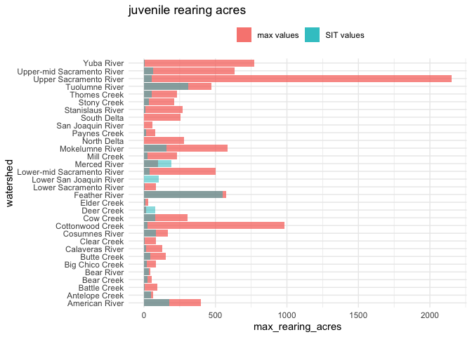
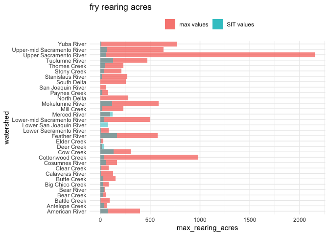
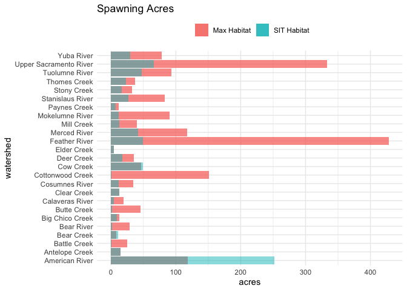
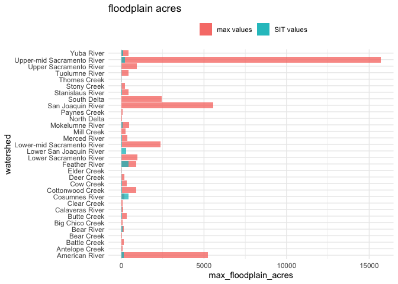
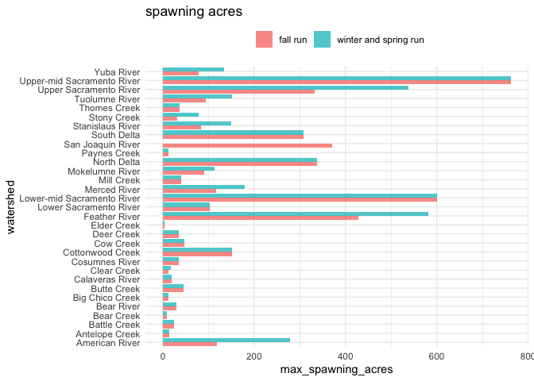

Max Theoretical Habitat to CVPIA SIT Habitat Comparison
================
Maddee Rubenson (FlowWest)
2023-04-18

## Fall Run

``` r
cvpia_habitat_data |> 
  glimpse()
```

    ## Rows: 29
    ## Columns: 8
    ## $ watershed      <chr> "Upper Sacramento River", "Antelope Creek", "Battle Cre…
    ## $ spwn_flow      <dbl> 5527.0, 71.8, 331.4, 19.9, 46.6, 141.9, 200.0, 130.0, 1…
    ## $ spwn_acres     <dbl> 66.5163197, 15.1128949, 0.4119558, 10.6933197, 9.412118…
    ## $ rear_flow      <dbl> 8457.50, 122.10, 456.55, 25.10, 72.25, 93.80, 200.00, 4…
    ## $ rear_acres_juv <dbl> 55.564613, 47.759832, 4.876994, 23.302430, 21.775447, 4…
    ## $ rear_acres_fry <dbl> 55.564613, 41.155411, 2.618267, 27.513710, 22.786453, 2…
    ## $ flood_flow     <dbl> 18694.000, 483.100, 968.900, 288.000, 456.400, 1240.200…
    ## $ flood_acres    <dbl> 10.6782216, 3.5286520, 0.0000000, 1.3197638, 0.0000000,…

``` r
all_max_habitat_fall |> 
  glimpse()
```

    ## Rows: 31
    ## Columns: 6
    ## Groups: watershed [31]
    ## $ watershed            <chr> "American River", "Clear Creek", "Feather River",…
    ## $ regulated            <chr> "yes + modeled with HEC RAS", "yes", "yes", "yes …
    ## $ max_spawning_acres   <dbl> 118.216740, 12.703260, 428.159285, 102.509876, 60…
    ## $ max_rearing_acres    <dbl> 399.70344, 82.47903, 572.92167, 85.42490, 500.264…
    ## $ max_floodplain_acres <dbl> 5247.77445, 68.25764, 887.86055, 984.35793, 2372.…
    ## $ run                  <chr> "fall run", "fall run", "fall run", "fall run", "…

``` r
all_habitat_data <- full_join(cvpia_habitat_data, all_max_habitat_fall) |> 
  glimpse()
```

    ## Rows: 32
    ## Columns: 13
    ## $ watershed            <chr> "Upper Sacramento River", "Antelope Creek", "Batt…
    ## $ spwn_flow            <dbl> 5527.0, 71.8, 331.4, 19.9, 46.6, 141.9, 200.0, 13…
    ## $ spwn_acres           <dbl> 66.5163197, 15.1128949, 0.4119558, 10.6933197, 9.…
    ## $ rear_flow            <dbl> 8457.50, 122.10, 456.55, 25.10, 72.25, 93.80, 200…
    ## $ rear_acres_juv       <dbl> 55.564613, 47.759832, 4.876994, 23.302430, 21.775…
    ## $ rear_acres_fry       <dbl> 55.564613, 41.155411, 2.618267, 27.513710, 22.786…
    ## $ flood_flow           <dbl> 18694.000, 483.100, 968.900, 288.000, 456.400, 12…
    ## $ flood_acres          <dbl> 10.6782216, 3.5286520, 0.0000000, 1.3197638, 0.00…
    ## $ regulated            <chr> "yes", "no", "no", "no", "no", "no", "yes", "no",…
    ## $ max_spawning_acres   <dbl> 332.882612, 14.503290, 25.043498, 8.121899, 13.01…
    ## $ max_rearing_acres    <dbl> 2150.97695, 62.39889, 92.36974, 52.82288, 84.5224…
    ## $ max_floodplain_acres <dbl> 921.90439, 86.23381, 144.47513, 51.03923, 89.1283…
    ## $ run                  <chr> "fall run", "fall run", "fall run", "fall run", "…

``` r
all_perc_increase <- all_habitat_data |> 
  mutate(instream_rearing_juv_perc_increase = (max_rearing_acres - rear_acres_juv)/rear_acres_juv * 100,
         instream_rearing_fry_perc_increase = (max_rearing_acres - rear_acres_fry)/rear_acres_fry * 100,
         spwn_perc_increase = (max_spawning_acres - spwn_acres)/spwn_acres * 100,
         flood_perc_increase = (max_floodplain_acres - flood_acres)/flood_acres * 100) |> 
  select(watershed, rear_acres_juv, rear_acres_fry, max_rearing_acres, 
         instream_rearing_juv_perc_increase, instream_rearing_fry_perc_increase,
         spwn_acres, max_spawning_acres, spwn_perc_increase, 
         flood_acres, max_floodplain_acres, flood_perc_increase)  |> 
  mutate(flag1 = ifelse(instream_rearing_juv_perc_increase < 0, "flag: juv", NA),
         flag2 = ifelse(instream_rearing_fry_perc_increase < 0, "flag: fry", NA),
         flag3 = ifelse(flood_perc_increase < 0, "flag: flood", NA),
         flag4 = ifelse(spwn_perc_increase < 0, "flag: spwn", NA)) 
  #write_csv('habitat_markdowns/data_output/max_hab_perc_increases.csv')
```

### Fry Rearing Differences:

``` r
all_perc_increase |> 
  select(watershed, rear_acres_fry, max_rearing_acres, instream_rearing_fry_perc_increase,
         flag1:flag4) |> 
  knitr::kable(digits = 1) 
```

| watershed                  | rear_acres_fry | max_rearing_acres | instream_rearing_fry_perc_increase | flag1     | flag2     | flag3       | flag4      |
|:---------------------------|---------------:|------------------:|-----------------------------------:|:----------|:----------|:------------|:-----------|
| Upper Sacramento River     |           55.6 |            2151.0 |                             3771.1 | NA        | NA        | NA          | NA         |
| Antelope Creek             |           41.2 |              62.4 |                               51.6 | NA        | NA        | NA          | flag: spwn |
| Battle Creek               |            2.6 |              92.4 |                             3427.9 | NA        | NA        | NA          | NA         |
| Bear Creek                 |           27.5 |              52.8 |                               92.0 | NA        | NA        | NA          | flag: spwn |
| Big Chico Creek            |           22.8 |              84.5 |                              270.9 | NA        | NA        | NA          | NA         |
| Butte Creek                |           29.1 |             150.2 |                              415.4 | NA        | NA        | NA          | NA         |
| Clear Creek                |            9.8 |              82.5 |                              741.3 | NA        | NA        | NA          | NA         |
| Cottonwood Creek           |           37.7 |             985.0 |                             2513.6 | NA        | NA        | NA          | NA         |
| Cow Creek                  |          131.2 |             302.6 |                              130.7 | NA        | NA        | NA          | flag: spwn |
| Deer Creek                 |           42.0 |              14.4 |                              -65.6 | flag: juv | flag: fry | NA          | NA         |
| Elder Creek                |           11.3 |              28.9 |                              156.1 | NA        | NA        | NA          | NA         |
| Mill Creek                 |           21.2 |             231.6 |                              989.8 | NA        | NA        | NA          | NA         |
| Paynes Creek               |           18.8 |              80.7 |                              329.3 | NA        | NA        | NA          | NA         |
| Stony Creek                |           41.6 |             209.1 |                              403.3 | NA        | NA        | NA          | NA         |
| Thomes Creek               |           42.4 |             230.7 |                              444.5 | NA        | NA        | flag: flood | NA         |
| Upper-mid Sacramento River |           62.8 |             635.0 |                              911.7 | NA        | NA        | NA          | NA         |
| Bear River                 |           40.0 |              46.8 |                               16.9 | NA        | NA        | NA          | NA         |
| Feather River              |          166.5 |             572.9 |                              244.1 | NA        | NA        | NA          | NA         |
| Yuba River                 |           11.0 |             770.6 |                             6892.3 | NA        | NA        | NA          | NA         |
| Lower-mid Sacramento River |           38.4 |             500.3 |                             1202.9 | NA        | NA        | NA          | NA         |
| American River             |           72.7 |             399.7 |                              450.1 | NA        | NA        | NA          | flag: spwn |
| Lower Sacramento River     |            5.2 |              85.4 |                             1537.1 | NA        | NA        | NA          | NA         |
| Calaveras River            |            6.5 |             126.9 |                             1858.6 | NA        | NA        | NA          | NA         |
| Cosumnes River             |           58.5 |             165.6 |                              183.2 | NA        | NA        | flag: flood | NA         |
| Mokelumne River            |          118.2 |             586.0 |                              395.9 | NA        | NA        | NA          | NA         |
| Merced River               |          124.6 |              97.7 |                              -21.6 | flag: juv | flag: fry | NA          | NA         |
| Stanislaus River           |           12.6 |             269.3 |                             2031.9 | NA        | NA        | NA          | NA         |
| Tuolumne River             |          127.9 |             471.6 |                              268.6 | NA        | NA        | NA          | NA         |
| Lower San Joaquin River    |           80.9 |                NA |                                 NA | NA        | NA        | NA          | NA         |
| San Joaquin River          |             NA |              61.6 |                                 NA | NA        | NA        | NA          | NA         |
| North Delta                |             NA |             282.0 |                                 NA | NA        | NA        | NA          | NA         |
| South Delta                |             NA |             256.5 |                                 NA | NA        | NA        | NA          | NA         |

### Juvenile Rearing Differences:

``` r
all_perc_increase |> 
  select(watershed, rear_acres_juv, max_rearing_acres, instream_rearing_fry_perc_increase, flag1:flag4) |> 
  knitr::kable(digits = 1)
```

| watershed                  | rear_acres_juv | max_rearing_acres | instream_rearing_fry_perc_increase | flag1     | flag2     | flag3       | flag4      |
|:---------------------------|---------------:|------------------:|-----------------------------------:|:----------|:----------|:------------|:-----------|
| Upper Sacramento River     |           55.6 |            2151.0 |                             3771.1 | NA        | NA        | NA          | NA         |
| Antelope Creek             |           47.8 |              62.4 |                               51.6 | NA        | NA        | NA          | flag: spwn |
| Battle Creek               |            4.9 |              92.4 |                             3427.9 | NA        | NA        | NA          | NA         |
| Bear Creek                 |           23.3 |              52.8 |                               92.0 | NA        | NA        | NA          | flag: spwn |
| Big Chico Creek            |           21.8 |              84.5 |                              270.9 | NA        | NA        | NA          | NA         |
| Butte Creek                |           43.1 |             150.2 |                              415.4 | NA        | NA        | NA          | NA         |
| Clear Creek                |            6.6 |              82.5 |                              741.3 | NA        | NA        | NA          | NA         |
| Cottonwood Creek           |           26.0 |             985.0 |                             2513.6 | NA        | NA        | NA          | NA         |
| Cow Creek                  |           79.6 |             302.6 |                              130.7 | NA        | NA        | NA          | flag: spwn |
| Deer Creek                 |           80.2 |              14.4 |                              -65.6 | flag: juv | flag: fry | NA          | NA         |
| Elder Creek                |            9.6 |              28.9 |                              156.1 | NA        | NA        | NA          | NA         |
| Mill Creek                 |           24.0 |             231.6 |                              989.8 | NA        | NA        | NA          | NA         |
| Paynes Creek               |           15.9 |              80.7 |                              329.3 | NA        | NA        | NA          | NA         |
| Stony Creek                |           35.2 |             209.1 |                              403.3 | NA        | NA        | NA          | NA         |
| Thomes Creek               |           52.8 |             230.7 |                              444.5 | NA        | NA        | flag: flood | NA         |
| Upper-mid Sacramento River |           62.8 |             635.0 |                              911.7 | NA        | NA        | NA          | NA         |
| Bear River                 |           34.6 |              46.8 |                               16.9 | NA        | NA        | NA          | NA         |
| Feather River              |          551.9 |             572.9 |                              244.1 | NA        | NA        | NA          | NA         |
| Yuba River                 |            4.6 |             770.6 |                             6892.3 | NA        | NA        | NA          | NA         |
| Lower-mid Sacramento River |           38.4 |             500.3 |                             1202.9 | NA        | NA        | NA          | NA         |
| American River             |          178.2 |             399.7 |                              450.1 | NA        | NA        | NA          | flag: spwn |
| Lower Sacramento River     |            5.2 |              85.4 |                             1537.1 | NA        | NA        | NA          | NA         |
| Calaveras River            |           16.4 |             126.9 |                             1858.6 | NA        | NA        | NA          | NA         |
| Cosumnes River             |           82.9 |             165.6 |                              183.2 | NA        | NA        | flag: flood | NA         |
| Mokelumne River            |          158.5 |             586.0 |                              395.9 | NA        | NA        | NA          | NA         |
| Merced River               |          192.5 |              97.7 |                              -21.6 | flag: juv | flag: fry | NA          | NA         |
| Stanislaus River           |            7.8 |             269.3 |                             2031.9 | NA        | NA        | NA          | NA         |
| Tuolumne River             |          311.0 |             471.6 |                              268.6 | NA        | NA        | NA          | NA         |
| Lower San Joaquin River    |          102.3 |                NA |                                 NA | NA        | NA        | NA          | NA         |
| San Joaquin River          |             NA |              61.6 |                                 NA | NA        | NA        | NA          | NA         |
| North Delta                |             NA |             282.0 |                                 NA | NA        | NA        | NA          | NA         |
| South Delta                |             NA |             256.5 |                                 NA | NA        | NA        | NA          | NA         |

``` r
ggplot(all_habitat_data) + 
  geom_col(aes(x = watershed, y = max_rearing_acres, fill =  "max values"),  alpha = 0.75) +
  geom_col(aes(x = watershed, y = rear_acres_juv, fill = "SIT values"),  alpha = 0.5) +
  ggtitle('juvenile rearing acres') +
  coord_flip() +
  theme_minimal() +
  theme(legend.position="top", 
        legend.title = element_blank())
```

<!-- -->

``` r
ggplot(all_habitat_data) + 
  geom_col(aes(x = watershed, y = max_rearing_acres, fill =  "max values"),  alpha = 0.75) +
  geom_col(aes(x = watershed, y = rear_acres_fry, fill = "SIT values"),  alpha = 0.5) +
  ggtitle('fry rearing acres') +
  coord_flip() +
  theme_minimal() +
  theme(legend.position="top", 
        legend.title = element_blank())
```

<!-- -->

### Spawning Differences:

``` r
all_perc_increase |> 
  select(watershed, spwn_acres, max_spawning_acres, spwn_perc_increase, flag1:flag4) |> 
  knitr::kable(digits = 1)
```

| watershed                  | spwn_acres | max_spawning_acres | spwn_perc_increase | flag1     | flag2     | flag3       | flag4      |
|:---------------------------|-----------:|-------------------:|-------------------:|:----------|:----------|:------------|:-----------|
| Upper Sacramento River     |       66.5 |              332.9 |              400.5 | NA        | NA        | NA          | NA         |
| Antelope Creek             |       15.1 |               14.5 |               -4.0 | NA        | NA        | NA          | flag: spwn |
| Battle Creek               |        0.4 |               25.0 |             5979.2 | NA        | NA        | NA          | NA         |
| Bear Creek                 |       10.7 |                8.1 |              -24.0 | NA        | NA        | NA          | flag: spwn |
| Big Chico Creek            |        9.4 |               13.0 |               38.3 | NA        | NA        | NA          | NA         |
| Butte Creek                |        1.8 |               45.3 |             2413.0 | NA        | NA        | NA          | NA         |
| Clear Creek                |       12.6 |               12.7 |                0.8 | NA        | NA        | NA          | NA         |
| Cottonwood Creek           |        0.9 |              151.5 |            16821.6 | NA        | NA        | NA          | NA         |
| Cow Creek                  |       49.7 |               46.6 |               -6.3 | NA        | NA        | NA          | flag: spwn |
| Deer Creek                 |       17.3 |               34.9 |              101.4 | flag: juv | flag: fry | NA          | NA         |
| Elder Creek                |        4.4 |                4.4 |                0.1 | NA        | NA        | NA          | NA         |
| Mill Creek                 |       13.0 |               39.7 |              205.3 | NA        | NA        | NA          | NA         |
| Paynes Creek               |        7.4 |               12.4 |               68.1 | NA        | NA        | NA          | NA         |
| Stony Creek                |       16.3 |               32.2 |               97.2 | NA        | NA        | NA          | NA         |
| Thomes Creek               |       23.4 |               36.8 |               56.9 | NA        | NA        | flag: flood | NA         |
| Upper-mid Sacramento River |         NA |              762.0 |                 NA | NA        | NA        | NA          | NA         |
| Bear River                 |        2.0 |               29.2 |             1388.9 | NA        | NA        | NA          | NA         |
| Feather River              |       49.8 |              428.2 |              760.4 | NA        | NA        | NA          | NA         |
| Yuba River                 |       29.5 |               77.8 |              163.9 | NA        | NA        | NA          | NA         |
| Lower-mid Sacramento River |         NA |              600.3 |                 NA | NA        | NA        | NA          | NA         |
| American River             |      251.5 |              118.2 |              -53.0 | NA        | NA        | NA          | flag: spwn |
| Lower Sacramento River     |         NA |              102.5 |                 NA | NA        | NA        | NA          | NA         |
| Calaveras River            |        4.4 |               19.5 |              339.5 | NA        | NA        | NA          | NA         |
| Cosumnes River             |       11.8 |               34.5 |              192.6 | NA        | NA        | flag: flood | NA         |
| Mokelumne River            |       11.9 |               90.1 |              654.7 | NA        | NA        | NA          | NA         |
| Merced River               |       42.2 |              117.3 |              178.2 | flag: juv | flag: fry | NA          | NA         |
| Stanislaus River           |       27.3 |               83.2 |              205.0 | NA        | NA        | NA          | NA         |
| Tuolumne River             |       47.5 |               93.6 |               97.1 | NA        | NA        | NA          | NA         |
| Lower San Joaquin River    |         NA |                 NA |                 NA | NA        | NA        | NA          | NA         |
| San Joaquin River          |         NA |              371.0 |                 NA | NA        | NA        | NA          | NA         |
| North Delta                |         NA |              338.4 |                 NA | NA        | NA        | NA          | NA         |
| South Delta                |         NA |              307.8 |                 NA | NA        | NA        | NA          | NA         |

``` r
all_habitat_data |> 
  filter(!is.na(spwn_acres)) |> 
  ggplot() + 
  geom_col(aes(x = watershed, y = max_spawning_acres, fill =  "Max Habitat"),  alpha = 0.75) +
  geom_col(aes(x = watershed, y = spwn_acres, fill = "SIT Habitat"),  alpha = 0.5) +
  ggtitle('Spawning Acres') + 
  ylab('acres') + 
  coord_flip() +
  theme_minimal() + 
  theme(legend.position="top", 
        legend.title = element_blank())
```

<!-- -->

### Floodplain Differences:

``` r
all_perc_increase |> 
  select(watershed, flood_acres, max_floodplain_acres, flood_perc_increase, flag1:flag4) |> 
  knitr::kable(digits = 1)
```

| watershed                  | flood_acres | max_floodplain_acres | flood_perc_increase | flag1     | flag2     | flag3       | flag4      |
|:---------------------------|------------:|---------------------:|--------------------:|:----------|:----------|:------------|:-----------|
| Upper Sacramento River     |        10.7 |                921.9 |              8533.5 | NA        | NA        | NA          | NA         |
| Antelope Creek             |         3.5 |                 86.2 |              2343.8 | NA        | NA        | NA          | flag: spwn |
| Battle Creek               |         0.0 |                144.5 |                 Inf | NA        | NA        | NA          | NA         |
| Bear Creek                 |         1.3 |                 51.0 |              3767.3 | NA        | NA        | NA          | flag: spwn |
| Big Chico Creek            |         0.0 |                 89.1 |                 Inf | NA        | NA        | NA          | NA         |
| Butte Creek                |        36.6 |                310.5 |               748.4 | NA        | NA        | NA          | NA         |
| Clear Creek                |         0.6 |                 68.3 |             11422.4 | NA        | NA        | NA          | NA         |
| Cottonwood Creek           |        27.1 |                896.1 |              3204.8 | NA        | NA        | NA          | NA         |
| Cow Creek                  |        51.2 |                314.5 |               513.8 | NA        | NA        | NA          | flag: spwn |
| Deer Creek                 |        13.6 |                197.7 |              1349.6 | flag: juv | flag: fry | NA          | NA         |
| Elder Creek                |         8.6 |                 18.8 |               118.2 | NA        | NA        | NA          | NA         |
| Mill Creek                 |         0.0 |                240.5 |                 Inf | NA        | NA        | NA          | NA         |
| Paynes Creek               |         1.0 |                 71.4 |              7215.2 | NA        | NA        | NA          | NA         |
| Stony Creek                |        13.8 |                217.4 |              1480.3 | NA        | NA        | NA          | NA         |
| Thomes Creek               |        10.8 |                 10.5 |                -2.2 | NA        | NA        | flag: flood | NA         |
| Upper-mid Sacramento River |       213.1 |              15696.8 |              7264.2 | NA        | NA        | NA          | NA         |
| Bear River                 |        64.4 |                161.3 |               150.5 | NA        | NA        | NA          | NA         |
| Feather River              |       442.0 |                887.9 |               100.9 | NA        | NA        | NA          | NA         |
| Yuba River                 |       100.9 |                427.2 |               323.4 | NA        | NA        | NA          | NA         |
| Lower-mid Sacramento River |        27.2 |               2372.1 |              8607.7 | NA        | NA        | NA          | NA         |
| American River             |       139.0 |               5247.8 |              3674.4 | NA        | NA        | NA          | flag: spwn |
| Lower Sacramento River     |        11.8 |                984.4 |              8258.7 | NA        | NA        | NA          | NA         |
| Calaveras River            |        19.7 |                102.6 |               421.5 | NA        | NA        | NA          | NA         |
| Cosumnes River             |       418.3 |                166.6 |               -60.2 | NA        | NA        | flag: flood | NA         |
| Mokelumne River            |        63.4 |                484.3 |               663.9 | NA        | NA        | NA          | NA         |
| Merced River               |        21.7 |                362.4 |              1566.8 | flag: juv | flag: fry | NA          | NA         |
| Stanislaus River           |        30.8 |                419.0 |              1262.5 | NA        | NA        | NA          | NA         |
| Tuolumne River             |        14.7 |                443.1 |              2909.8 | NA        | NA        | NA          | NA         |
| Lower San Joaquin River    |       303.4 |                   NA |                  NA | NA        | NA        | NA          | NA         |
| San Joaquin River          |          NA |               5565.1 |                  NA | NA        | NA        | NA          | NA         |
| North Delta                |          NA |                 48.3 |                  NA | NA        | NA        | NA          | NA         |
| South Delta                |          NA |               2424.7 |                  NA | NA        | NA        | NA          | NA         |

``` r
ggplot(all_habitat_data) + 
  geom_col(aes(x = watershed, y = max_floodplain_acres, fill =  "max values"), alpha = 0.75) +
  geom_col(aes(x = watershed, y = flood_acres, fill = "SIT values"), alpha = 0.75) +
  ggtitle('floodplain acres') +
  coord_flip() + 
  theme_minimal() +
  theme(legend.position="top", 
        legend.title = element_blank())
```

<!-- -->

### Compare Max Habitat across Runs

``` r
all_max_hab <- all_max_habitat_fall |> bind_rows(all_max_habitat_winter_spring)

ggplot(all_max_hab) + 
  geom_col(aes(x = watershed, y = max_spawning_acres, fill =  run), alpha = 0.75, 
           position = "dodge") +
  #geom_col(aes(x = watershed, y = max_floodplain_acres, fill = "SIT values"), alpha = 0.75) +
  ggtitle('spawning acres') +
  coord_flip() + 
  theme_minimal() +
  theme(legend.position="top", 
        legend.title = element_blank())
```

<!-- -->
