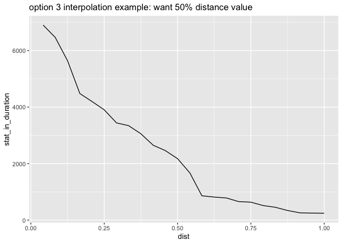
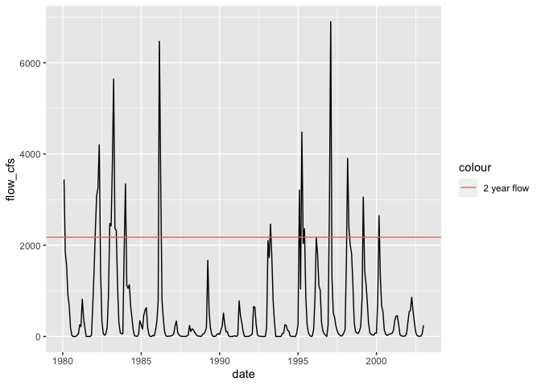

CVPIA Habitat Values
================
Maddee Rubenson (FlowWest)
2023-02-16

## Flood Duration Methodology

**Objective**: Calculate the flow that is exceeded in 50% of the years

**Method**: Take the yearly rolling maximum of monthly CalSim flows \>
1980. Apply a cumulative distribution function on the ranked values to
find the proportion of all values less than or equal to the ranked
order. Create an interpolation function to find the 2 year flow value

``` r
watershed_input <- "Cosumnes River"

flood_flow_ex = DSMflow::flows_cfs$biop_itp_2018_2019 |> 
      filter(date >= as_date("1980-01-01")) |> 
      select(watershed_input, date) |> 
      rename(flow_cfs = watershed_input) 
    
exceedance_probs_monthly_fun <- exceedance_probs_monthly(flood_flow_ex, 'min', 'max')
calsim_30_day(flood_flow_ex, exceedance_probs_monthly_fun)
```

    ## [1] 2175

``` r
ggplot(exceedance_probs_monthly_fun, aes(x = dist, y = stat_in_duration)) + 
  geom_line() + 
  ggtitle('option 3 interpolation example: want 50% distance value')
```

<!-- -->

``` r
# plot it: 
ggplot(DSMflow::flows_cfs$biop_itp_2018_2019 |> 
      filter(date >= as_date("1980-01-01")) |> 
      select(watershed_input, date) |> 
      rename(flow_cfs = watershed_input)) +
  geom_line(aes(x = date, y = flow_cfs)) +
  geom_hline(aes(yintercept = calsim_30_day(flood_flow_ex, exceedance_probs_monthly_fun), color = "2 year flow"))
```

<!-- -->

## Calculate Habitat for SIT Watersheds

#### Define Inputs:

``` r
# missing sutter bypass and yolo bypass 
watersheds_labels <- DSMscenario::watershed_labels[-c(17, 22)]


# not included in floodplain suitability factor 
modeling_in_suitable_area <- c("Antelope Creek", "Battle Creek", "Bear Creek", 
                               "Cow Creek", "Mill Creek", "Paynes Creek", 
                               "Deer Creek",'Upper Sacramento River',
                               'Upper-mid Sacramento River','Lower Sacramento River')

spawning_months <- c(10:12)
rearing_months <- c(1:8)
```

``` r
sit_outputs <- data.frame()
for(i in 1:length(watersheds_labels)) {
  watershed_input <- watersheds_labels[i]
  
  if (watershed_input == "Lower-mid Sacramento River") {
    # The Lower-mid Sacramento River has two nodes, one above Fremont Weir (C134) and one below (C160). 
    # rearing: 
    rear_flow1 <- existing_flow_cfs("rearing", "Lower-mid Sacramento River1")
    rear_flow2 <- existing_flow_cfs("rearing", "Lower-mid Sacramento River2")
    
    rear_acres_juv <- square_meters_to_acres(DSMhabitat::set_instream_habitat('Lower-mid Sacramento River', 
                                                                              species = "fr", life_stage = "juv",
                                                                              rear_flow1, rear_flow2))
    rear_acres_fry <- square_meters_to_acres(DSMhabitat::set_instream_habitat('Lower-mid Sacramento River',
                                                                              "fr", "fry",  rear_flow1, rear_flow2))
    
    # floodplain: 
    flood_flow1 <- existing_flow_cfs("flood", "Lower-mid Sacramento River1")
    flood_flow2 <- existing_flow_cfs("flood", "Lower-mid Sacramento River2")
    flow_acres = square_meters_to_acres(set_floodplain_habitat("Lower-mid Sacramento River", "fr", 
                                                               flood_flow1, flood_flow2))
    

    spwn_acres = NA
    spwn_flow = NA
    rear_flow = NA
    flood_flow = NA
    
  } else {
    spwn_flow <- existing_flow_cfs("spawning", watershed_input)
    spwn_acres <- square_meters_to_acres(set_spawning_habitat(watershed_input, "fr", spwn_flow, month = 10))
    
    rear_flow <- existing_flow_cfs("rearing", watershed_input)
    rear_acres_juv <- square_meters_to_acres(DSMhabitat::set_instream_habitat(watershed_input, "fr", "juv", rear_flow))
    rear_acres_fry <- square_meters_to_acres(DSMhabitat::set_instream_habitat(watershed_input, "fr", "fry", rear_flow))
    
    flood_flow <- existing_flow_cfs("flood", watershed_input)
    flood_acres <- square_meters_to_acres(DSMhabitat::set_floodplain_habitat(watershed_input, "fr", flood_flow))
  }
  
  if (!(watershed_input %in% modeling_in_suitable_area)) {
    flood_acres <- DSMhabitat::apply_suitability(flood_acres)
  }
  
  sit_outputs <- bind_rows(sit_outputs, 
                           tibble(
                             watershed = watershed_input, 
                             spwn_flow = spwn_flow, 
                             spwn_acres = spwn_acres, 
                             rear_flow = rear_flow, 
                             rear_acres_juv = rear_acres_juv,
                             rear_acres_fry = rear_acres_fry,
                             flood_flow = flood_flow, 
                             flood_acres = flood_acres
                           )
  )
  
}

knitr::kable(sit_outputs, digits = 1)
```

| watershed                  | spwn_flow | spwn_acres | rear_flow | rear_acres_juv | rear_acres_fry | flood_flow | flood_acres |
|:---------------------------|----------:|-----------:|----------:|---------------:|---------------:|-----------:|------------:|
| Upper Sacramento River     |      5700 |       66.2 |    8346.0 |           55.8 |           55.8 |      14877 |         7.2 |
| Antelope Creek             |        72 |       15.1 |     119.0 |           47.8 |           41.5 |        456 |         2.2 |
| Battle Creek               |       322 |        0.4 |     454.5 |            4.9 |            2.6 |        973 |         0.0 |
| Bear Creek                 |        20 |       10.7 |      26.5 |           23.3 |           27.5 |        281 |         1.2 |
| Big Chico Creek            |        46 |        9.4 |      71.0 |           21.7 |           22.9 |        446 |         0.0 |
| Butte Creek                |       136 |        1.8 |      79.5 |           42.0 |           31.7 |       1259 |        37.0 |
| Clear Creek                |       200 |       12.6 |     200.0 |            6.6 |            9.8 |        374 |         0.7 |
| Cottonwood Creek           |       140 |        0.8 |     443.0 |           26.2 |           38.4 |       3396 |        23.0 |
| Cow Creek                  |       165 |       49.7 |     368.5 |           79.6 |          131.2 |       2731 |        45.6 |
| Deer Creek                 |       136 |       17.3 |     263.5 |           80.1 |           42.0 |       1166 |        12.5 |
| Elder Creek                |        10 |        4.4 |      51.0 |            9.6 |           11.3 |        423 |         8.6 |
| Mill Creek                 |       139 |       13.0 |     293.5 |           23.8 |           21.2 |        726 |         0.0 |
| Paynes Creek               |        20 |        7.4 |      26.5 |           15.9 |           18.8 |        281 |         0.9 |
| Stony Creek                |        11 |       16.3 |      18.0 |           35.2 |           41.6 |       1816 |        13.6 |
| Thomes Creek               |        36 |       23.4 |     181.0 |           53.1 |           42.6 |       1003 |         9.8 |
| Upper-mid Sacramento River |      7531 |         NA |    8984.5 |           63.4 |           63.4 |      30497 |       163.1 |
| Bear River                 |        10 |        1.5 |     380.0 |           34.5 |           40.1 |       1645 |        64.5 |
| Feather River              |      2179 |       42.7 |    2310.0 |          541.0 |          135.0 |       9667 |       431.8 |
| Yuba River                 |       712 |       29.2 |    1381.5 |            4.6 |           11.1 |       6481 |        94.4 |
| Lower-mid Sacramento River |        NA |         NA |        NA |           38.1 |           38.1 |         NA |        25.5 |
| American River             |      1826 |      250.2 |    2640.5 |          137.0 |           62.1 |       7284 |       106.8 |
| Lower Sacramento River     |     12536 |         NA |   17127.5 |            5.0 |            5.0 |      49684 |        11.3 |
| Calaveras River            |        20 |        4.4 |     134.5 |           16.3 |            6.3 |       1280 |        18.7 |
| Cosumnes River             |        57 |       11.8 |     265.5 |           82.4 |           57.4 |       2175 |       399.6 |
| Mokelumne River            |       487 |       13.9 |     505.0 |          135.1 |          100.5 |       1350 |        66.7 |
| Merced River               |       113 |       29.6 |     238.0 |          202.9 |          131.7 |       1987 |        23.0 |
| Stanislaus River           |       200 |       27.3 |     300.0 |            7.3 |           13.0 |       1555 |        30.8 |
| Tuolumne River             |       300 |       47.5 |     324.5 |          303.4 |          124.2 |       1633 |        26.5 |
| San Joaquin River          |      1117 |         NA |    1771.5 |          103.5 |           83.2 |       4401 |       272.1 |

``` r
write_csv(sit_outputs,'../CVPIA_habitat_data.csv')
```

## Calculate Bypass Habitat:

Only suitable for rearing?
<https://cvpia-osc.github.io/DSMhabitat/reference/bypass_habitat.html>

``` r
bypasses <- tibble(bypass = c(rep("Yolo Bypass",2), rep("Sutter Bypass",4 )),
                   names = c("yolo1", "yolo2", "sutter1", "sutter2", "sutter3", "sutter4"))

bypass_outputs <- data.frame()
for(i in 1:length(bypasses$names)) {
  bypass_outputs <- bind_rows(bypass_outputs, 
                              tibble(
                                bypass_name = bypasses$names[i], 
                                bypass = bypasses$bypass[i],
                                rear_flow = existing_flow_cfs("rearing", bypasses$names[i], bypass = TRUE),
                                rear_habitat = square_meters_to_acres(DSMhabitat::set_bypass_habitat(bypasses$names[i], rear_flow))
                              )
  )
  
}

bypass_totals <- bypass_outputs |> 
  group_by(bypass) |> 
  summarise(total_rear_acres = sum(rear_habitat))

knitr::kable(bypass_totals, digits = 1)
```

| bypass        | total_rear_acres |
|:--------------|-----------------:|
| Sutter Bypass |           1806.0 |
| Yolo Bypass   |            271.4 |

## Delta Habitats

``` r
delta_rearing_habitat |> 
  select(date, `North Delta`) |> 
  filter(month(date) %in% rearing_months) |> 
  summarise(mean_area = mean(`North Delta`),
            mean_acres = square_meters_to_acres(mean_area),
            median = square_meters_to_acres(median(`North Delta`))) |> 
  knitr::kable()
```

| mean_area | mean_acres |   median |
|----------:|-----------:|---------:|
|  21849416 |     5399.1 | 5101.251 |

``` r
delta_rearing_habitat |> 
  select(date, `South Delta`) |> 
  filter(month(date) %in% rearing_months) |> 
  summarise(mean_area = mean(`South Delta`),
            mean_acres = square_meters_to_acres(mean_area)) |> 
  knitr::kable()
```

| mean_area | mean_acres |
|----------:|-----------:|
|  20399852 |   5040.906 |
