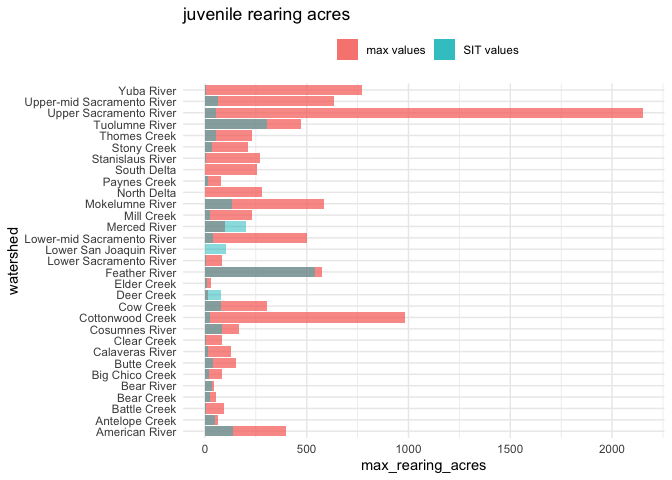
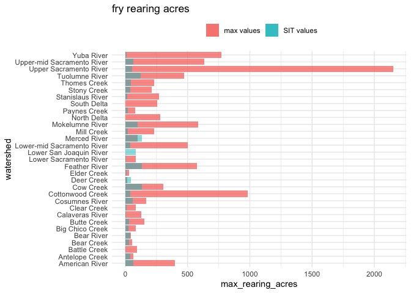
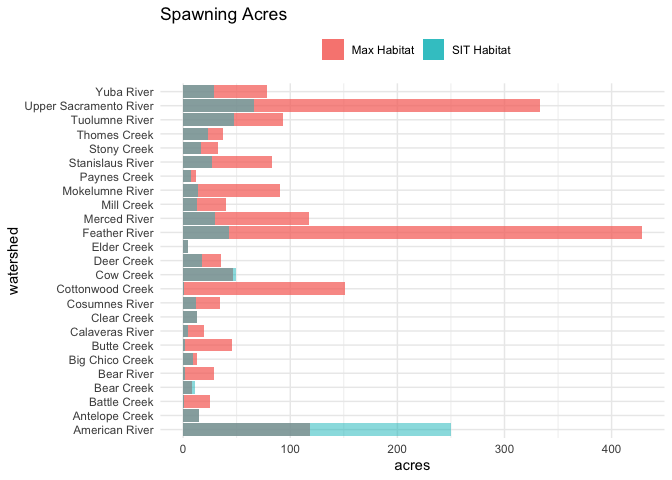
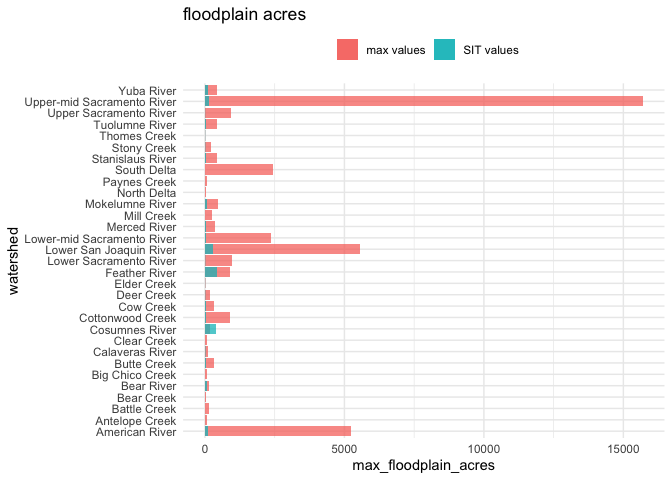

Max Theoretical Habitat to CVPIA SIT Habitat Comparison
================
Maddee Rubenson (FlowWest)
2023-02-16

``` r
cvpia_habitat_data |> 
  glimpse()
```

    ## Rows: 29
    ## Columns: 8
    ## $ watershed      <chr> "Upper Sacramento River", "Antelope Creek", "Battle Cre…
    ## $ spwn_flow      <dbl> 5700, 72, 322, 20, 46, 136, 200, 140, 165, 136, 10, 139…
    ## $ spwn_acres     <dbl> 66.1504657, 15.1156905, 0.4307368, 10.6933197, 9.412118…
    ## $ rear_flow      <dbl> 8346.0, 119.0, 454.5, 26.5, 71.0, 79.5, 200.0, 443.0, 3…
    ## $ rear_acres_juv <dbl> 55.841084, 47.752905, 4.876994, 23.302430, 21.691570, 4…
    ## $ rear_acres_fry <dbl> 55.841084, 41.549759, 2.618267, 27.513710, 22.851705, 3…
    ## $ flood_flow     <dbl> 14877, 456, 973, 281, 446, 1259, 374, 3396, 2731, 1166,…
    ## $ flood_acres    <dbl> 7.1583510, 2.1982979, 0.0000000, 1.1921654, 0.0000000, …

``` r
all_max_habitat |> 
  glimpse()
```

    ## Rows: 31
    ## Columns: 6
    ## $ ...1                 <dbl> 1, 2, 3, 4, 5, 6, 7, 8, 9, 10, 11, 12, 13, 14, 15…
    ## $ watershed            <chr> "American River", "Clear Creek", "Feather River",…
    ## $ regulated            <chr> "yes + modeled with HEC RAS", "yes", "yes", "yes …
    ## $ max_spawning_acres   <dbl> 118.216740, 12.703260, 428.159285, 102.509876, 37…
    ## $ max_rearing_acres    <dbl> 399.70344, 82.47903, 572.92167, 85.42490, 0.00000…
    ## $ max_floodplain_acres <dbl> 5247.77445, 68.25764, 887.86055, 984.35793, 5565.…

``` r
all_habitat_data <- full_join(cvpia_habitat_data, all_max_habitat) |> 
  glimpse()
```

    ## Rows: 31
    ## Columns: 13
    ## $ watershed            <chr> "Upper Sacramento River", "Antelope Creek", "Batt…
    ## $ spwn_flow            <dbl> 5700, 72, 322, 20, 46, 136, 200, 140, 165, 136, 1…
    ## $ spwn_acres           <dbl> 66.1504657, 15.1156905, 0.4307368, 10.6933197, 9.…
    ## $ rear_flow            <dbl> 8346.0, 119.0, 454.5, 26.5, 71.0, 79.5, 200.0, 44…
    ## $ rear_acres_juv       <dbl> 55.841084, 47.752905, 4.876994, 23.302430, 21.691…
    ## $ rear_acres_fry       <dbl> 55.841084, 41.549759, 2.618267, 27.513710, 22.851…
    ## $ flood_flow           <dbl> 14877, 456, 973, 281, 446, 1259, 374, 3396, 2731,…
    ## $ flood_acres          <dbl> 7.1583510, 2.1982979, 0.0000000, 1.1921654, 0.000…
    ## $ ...1                 <dbl> 12, 15, 16, 17, 19, 20, 2, 23, 24, 25, 26, 27, 29…
    ## $ regulated            <chr> "yes", "no", "no", "no", "no", "no", "yes", "no",…
    ## $ max_spawning_acres   <dbl> 332.882612, 14.503290, 25.043498, 8.121899, 13.01…
    ## $ max_rearing_acres    <dbl> 2150.97695, 62.39889, 92.36974, 52.82288, 84.5224…
    ## $ max_floodplain_acres <dbl> 921.90439, 86.23381, 144.47513, 51.03923, 89.1283…

``` r
all_perc_increase <- all_habitat_data |> 
  mutate(instream_rearing_juv_perc_increase = (max_rearing_acres - rear_acres_juv)/rear_acres_juv * 100,
         instream_rearing_fry_perc_increase = (max_rearing_acres - rear_acres_fry)/rear_acres_fry * 100,
         spwn_perc_increase = (max_spawning_acres - spwn_acres)/spwn_acres * 100,
         flood_perc_increase = (max_floodplain_acres - flood_acres)/flood_acres * 100) |> 
  select(watershed, regulated, rear_acres_juv, rear_acres_fry, max_rearing_acres, 
         instream_rearing_juv_perc_increase, instream_rearing_fry_perc_increase,
         spwn_acres, max_spawning_acres, spwn_perc_increase, 
         flood_acres, max_floodplain_acres, flood_perc_increase)  |> 
  mutate(flag1 = ifelse(instream_rearing_juv_perc_increase < 0, "flag: juv", NA),
         flag2 = ifelse(instream_rearing_fry_perc_increase < 0, "flag: fry", NA),
         flag3 = ifelse(flood_perc_increase < 0, "flag: flood", NA),
         flag4 = ifelse(spwn_perc_increase < 0, "flag: spwn", NA)) 
  #write_csv('habitat_markdowns/data_output/max_hab_perc_increases.csv')
```

### Fry Rearing Differences:

``` r
all_perc_increase |> 
  select(watershed, regulated, rear_acres_fry, max_rearing_acres, instream_rearing_fry_perc_increase,
         flag1:flag4) |> 
  knitr::kable(digits = 1) 
```

| watershed                  | regulated                  | rear_acres_fry | max_rearing_acres | instream_rearing_fry_perc_increase | flag1     | flag2     | flag3       | flag4      |
|:---------------------------|:---------------------------|---------------:|------------------:|-----------------------------------:|:----------|:----------|:------------|:-----------|
| Upper Sacramento River     | yes                        |           55.8 |            2151.0 |                             3752.0 | NA        | NA        | NA          | NA         |
| Antelope Creek             | no                         |           41.5 |              62.4 |                               50.2 | NA        | NA        | NA          | flag: spwn |
| Battle Creek               | no                         |            2.6 |              92.4 |                             3427.9 | NA        | NA        | NA          | NA         |
| Bear Creek                 | no                         |           27.5 |              52.8 |                               92.0 | NA        | NA        | NA          | flag: spwn |
| Big Chico Creek            | no                         |           22.9 |              84.5 |                              269.9 | NA        | NA        | NA          | NA         |
| Butte Creek                | no                         |           31.7 |             150.2 |                              373.5 | NA        | NA        | NA          | NA         |
| Clear Creek                | yes                        |            9.8 |              82.5 |                              741.3 | NA        | NA        | NA          | NA         |
| Cottonwood Creek           | no                         |           38.4 |             985.0 |                             2462.3 | NA        | NA        | NA          | NA         |
| Cow Creek                  | no                         |          131.2 |             302.6 |                              130.7 | NA        | NA        | NA          | flag: spwn |
| Deer Creek                 | no                         |           42.0 |              14.4 |                              -65.7 | flag: juv | flag: fry | NA          | NA         |
| Elder Creek                | no                         |           11.3 |              28.9 |                              156.2 | NA        | NA        | NA          | NA         |
| Mill Creek                 | no                         |           21.2 |             231.6 |                              992.6 | NA        | NA        | NA          | NA         |
| Paynes Creek               | no                         |           18.8 |              80.7 |                              329.3 | NA        | NA        | NA          | NA         |
| Stony Creek                | yes                        |           41.6 |             209.1 |                              403.3 | NA        | NA        | NA          | NA         |
| Thomes Creek               | no                         |           42.6 |             230.7 |                              441.4 | NA        | NA        | NA          | NA         |
| Upper-mid Sacramento River | yes + modeled with HEC RAS |           63.4 |             635.0 |                              901.3 | NA        | NA        | NA          | NA         |
| Bear River                 | no                         |           40.1 |              46.8 |                               16.8 | NA        | NA        | NA          | NA         |
| Feather River              | yes                        |          135.0 |             572.9 |                              324.4 | NA        | NA        | NA          | NA         |
| Yuba River                 | yes                        |           11.1 |             770.6 |                             6848.8 | NA        | NA        | NA          | NA         |
| Lower-mid Sacramento River | yes + modeled with HEC RAS |           38.1 |             500.3 |                             1211.8 | NA        | NA        | NA          | NA         |
| American River             | yes + modeled with HEC RAS |           62.1 |             399.7 |                              544.0 | NA        | NA        | NA          | flag: spwn |
| Lower Sacramento River     | yes + modeled with HEC RAS |            5.0 |              85.4 |                             1602.1 | NA        | NA        | NA          | NA         |
| Calaveras River            | no                         |            6.3 |             126.9 |                             1902.1 | NA        | NA        | NA          | NA         |
| Cosumnes River             | no                         |           57.4 |             165.6 |                              188.6 | NA        | NA        | flag: flood | NA         |
| Mokelumne River            | yes                        |          100.5 |             586.0 |                              483.1 | NA        | NA        | NA          | NA         |
| Merced River               | yes                        |          131.7 |              97.7 |                              -25.8 | flag: juv | flag: fry | NA          | NA         |
| Stanislaus River           | yes                        |           13.0 |             269.3 |                             1973.4 | NA        | NA        | NA          | NA         |
| Tuolumne River             | yes                        |          124.2 |             471.6 |                              279.9 | NA        | NA        | NA          | NA         |
| Lower San Joaquin River    | yes                        |           83.2 |               0.0 |                             -100.0 | flag: juv | flag: fry | NA          | NA         |
| North Delta                | no                         |             NA |             282.0 |                                 NA | NA        | NA        | NA          | NA         |
| South Delta                | no                         |             NA |             256.5 |                                 NA | NA        | NA        | NA          | NA         |

### Juvenile Rearing Differences:

``` r
all_perc_increase |> 
  select(watershed, regulated, rear_acres_juv, max_rearing_acres, instream_rearing_fry_perc_increase, flag1:flag4) |> 
  knitr::kable(digits = 1)
```

| watershed                  | regulated                  | rear_acres_juv | max_rearing_acres | instream_rearing_fry_perc_increase | flag1     | flag2     | flag3       | flag4      |
|:---------------------------|:---------------------------|---------------:|------------------:|-----------------------------------:|:----------|:----------|:------------|:-----------|
| Upper Sacramento River     | yes                        |           55.8 |            2151.0 |                             3752.0 | NA        | NA        | NA          | NA         |
| Antelope Creek             | no                         |           47.8 |              62.4 |                               50.2 | NA        | NA        | NA          | flag: spwn |
| Battle Creek               | no                         |            4.9 |              92.4 |                             3427.9 | NA        | NA        | NA          | NA         |
| Bear Creek                 | no                         |           23.3 |              52.8 |                               92.0 | NA        | NA        | NA          | flag: spwn |
| Big Chico Creek            | no                         |           21.7 |              84.5 |                              269.9 | NA        | NA        | NA          | NA         |
| Butte Creek                | no                         |           42.0 |             150.2 |                              373.5 | NA        | NA        | NA          | NA         |
| Clear Creek                | yes                        |            6.6 |              82.5 |                              741.3 | NA        | NA        | NA          | NA         |
| Cottonwood Creek           | no                         |           26.2 |             985.0 |                             2462.3 | NA        | NA        | NA          | NA         |
| Cow Creek                  | no                         |           79.6 |             302.6 |                              130.7 | NA        | NA        | NA          | flag: spwn |
| Deer Creek                 | no                         |           80.1 |              14.4 |                              -65.7 | flag: juv | flag: fry | NA          | NA         |
| Elder Creek                | no                         |            9.6 |              28.9 |                              156.2 | NA        | NA        | NA          | NA         |
| Mill Creek                 | no                         |           23.8 |             231.6 |                              992.6 | NA        | NA        | NA          | NA         |
| Paynes Creek               | no                         |           15.9 |              80.7 |                              329.3 | NA        | NA        | NA          | NA         |
| Stony Creek                | yes                        |           35.2 |             209.1 |                              403.3 | NA        | NA        | NA          | NA         |
| Thomes Creek               | no                         |           53.1 |             230.7 |                              441.4 | NA        | NA        | NA          | NA         |
| Upper-mid Sacramento River | yes + modeled with HEC RAS |           63.4 |             635.0 |                              901.3 | NA        | NA        | NA          | NA         |
| Bear River                 | no                         |           34.5 |              46.8 |                               16.8 | NA        | NA        | NA          | NA         |
| Feather River              | yes                        |          541.0 |             572.9 |                              324.4 | NA        | NA        | NA          | NA         |
| Yuba River                 | yes                        |            4.6 |             770.6 |                             6848.8 | NA        | NA        | NA          | NA         |
| Lower-mid Sacramento River | yes + modeled with HEC RAS |           38.1 |             500.3 |                             1211.8 | NA        | NA        | NA          | NA         |
| American River             | yes + modeled with HEC RAS |          137.0 |             399.7 |                              544.0 | NA        | NA        | NA          | flag: spwn |
| Lower Sacramento River     | yes + modeled with HEC RAS |            5.0 |              85.4 |                             1602.1 | NA        | NA        | NA          | NA         |
| Calaveras River            | no                         |           16.3 |             126.9 |                             1902.1 | NA        | NA        | NA          | NA         |
| Cosumnes River             | no                         |           82.4 |             165.6 |                              188.6 | NA        | NA        | flag: flood | NA         |
| Mokelumne River            | yes                        |          135.1 |             586.0 |                              483.1 | NA        | NA        | NA          | NA         |
| Merced River               | yes                        |          202.9 |              97.7 |                              -25.8 | flag: juv | flag: fry | NA          | NA         |
| Stanislaus River           | yes                        |            7.3 |             269.3 |                             1973.4 | NA        | NA        | NA          | NA         |
| Tuolumne River             | yes                        |          303.4 |             471.6 |                              279.9 | NA        | NA        | NA          | NA         |
| Lower San Joaquin River    | yes                        |          103.5 |               0.0 |                             -100.0 | flag: juv | flag: fry | NA          | NA         |
| North Delta                | no                         |             NA |             282.0 |                                 NA | NA        | NA        | NA          | NA         |
| South Delta                | no                         |             NA |             256.5 |                                 NA | NA        | NA        | NA          | NA         |

``` r
ggplot(all_habitat_data) + 
  geom_col(aes(x = watershed, y = max_rearing_acres, fill =  "max values"),  alpha = 0.75) +
  geom_col(aes(x = watershed, y = rear_acres_juv, fill = "SIT values"),  alpha = 0.5) +
  ggtitle('juvenile rearing acres') +
  coord_flip() +
  theme_minimal() +
  theme(legend.position="top", 
        legend.title = element_blank())
```

<!-- -->

``` r
ggplot(all_habitat_data) + 
  geom_col(aes(x = watershed, y = max_rearing_acres, fill =  "max values"),  alpha = 0.75) +
  geom_col(aes(x = watershed, y = rear_acres_fry, fill = "SIT values"),  alpha = 0.5) +
  ggtitle('fry rearing acres') +
  coord_flip() +
  theme_minimal() +
  theme(legend.position="top", 
        legend.title = element_blank())
```

<!-- -->

### Spawning Differences:

``` r
all_perc_increase |> 
  select(watershed, regulated, spwn_acres, max_spawning_acres, spwn_perc_increase, flag1:flag4) |> 
  knitr::kable(digits = 1)
```

| watershed                  | regulated                  | spwn_acres | max_spawning_acres | spwn_perc_increase | flag1     | flag2     | flag3       | flag4      |
|:---------------------------|:---------------------------|-----------:|-------------------:|-------------------:|:----------|:----------|:------------|:-----------|
| Upper Sacramento River     | yes                        |       66.2 |              332.9 |              403.2 | NA        | NA        | NA          | NA         |
| Antelope Creek             | no                         |       15.1 |               14.5 |               -4.1 | NA        | NA        | NA          | flag: spwn |
| Battle Creek               | no                         |        0.4 |               25.0 |             5714.1 | NA        | NA        | NA          | NA         |
| Bear Creek                 | no                         |       10.7 |                8.1 |              -24.0 | NA        | NA        | NA          | flag: spwn |
| Big Chico Creek            | no                         |        9.4 |               13.0 |               38.3 | NA        | NA        | NA          | NA         |
| Butte Creek                | no                         |        1.8 |               45.3 |             2439.0 | NA        | NA        | NA          | NA         |
| Clear Creek                | yes                        |       12.6 |               12.7 |                0.8 | NA        | NA        | NA          | NA         |
| Cottonwood Creek           | no                         |        0.8 |              151.5 |            18025.3 | NA        | NA        | NA          | NA         |
| Cow Creek                  | no                         |       49.7 |               46.6 |               -6.3 | NA        | NA        | NA          | flag: spwn |
| Deer Creek                 | no                         |       17.3 |               34.9 |              102.2 | flag: juv | flag: fry | NA          | NA         |
| Elder Creek                | no                         |        4.4 |                4.4 |                0.1 | NA        | NA        | NA          | NA         |
| Mill Creek                 | no                         |       13.0 |               39.7 |              205.3 | NA        | NA        | NA          | NA         |
| Paynes Creek               | no                         |        7.4 |               12.4 |               68.1 | NA        | NA        | NA          | NA         |
| Stony Creek                | yes                        |       16.3 |               32.2 |               97.2 | NA        | NA        | NA          | NA         |
| Thomes Creek               | no                         |       23.4 |               36.8 |               56.9 | NA        | NA        | NA          | NA         |
| Upper-mid Sacramento River | yes + modeled with HEC RAS |         NA |              762.0 |                 NA | NA        | NA        | NA          | NA         |
| Bear River                 | no                         |        1.5 |               29.2 |             1812.4 | NA        | NA        | NA          | NA         |
| Feather River              | yes                        |       42.7 |              428.2 |              903.2 | NA        | NA        | NA          | NA         |
| Yuba River                 | yes                        |       29.2 |               77.8 |              166.1 | NA        | NA        | NA          | NA         |
| Lower-mid Sacramento River | yes + modeled with HEC RAS |         NA |              600.3 |                 NA | NA        | NA        | NA          | NA         |
| American River             | yes + modeled with HEC RAS |      250.2 |              118.2 |              -52.8 | NA        | NA        | NA          | flag: spwn |
| Lower Sacramento River     | yes + modeled with HEC RAS |         NA |              102.5 |                 NA | NA        | NA        | NA          | NA         |
| Calaveras River            | no                         |        4.4 |               19.5 |              348.4 | NA        | NA        | NA          | NA         |
| Cosumnes River             | no                         |       11.8 |               34.5 |              192.6 | NA        | NA        | flag: flood | NA         |
| Mokelumne River            | yes                        |       13.9 |               90.1 |              547.4 | NA        | NA        | NA          | NA         |
| Merced River               | yes                        |       29.6 |              117.3 |              296.0 | flag: juv | flag: fry | NA          | NA         |
| Stanislaus River           | yes                        |       27.3 |               83.2 |              205.0 | NA        | NA        | NA          | NA         |
| Tuolumne River             | yes                        |       47.5 |               93.6 |               97.1 | NA        | NA        | NA          | NA         |
| Lower San Joaquin River    | yes                        |         NA |              371.0 |                 NA | flag: juv | flag: fry | NA          | NA         |
| North Delta                | no                         |         NA |              338.4 |                 NA | NA        | NA        | NA          | NA         |
| South Delta                | no                         |         NA |              307.8 |                 NA | NA        | NA        | NA          | NA         |

``` r
all_habitat_data |> 
  filter(!is.na(spwn_acres)) |> 
  ggplot() + 
  geom_col(aes(x = watershed, y = max_spawning_acres, fill =  "Max Habitat"),  alpha = 0.75) +
  geom_col(aes(x = watershed, y = spwn_acres, fill = "SIT Habitat"),  alpha = 0.5) +
  ggtitle('Spawning Acres') + 
  ylab('acres') + 
  coord_flip() +
  theme_minimal() + 
  theme(legend.position="top", 
        legend.title = element_blank())
```

<!-- -->

### Floodplain Differences:

``` r
all_perc_increase |> 
  select(watershed, regulated, flood_acres, max_floodplain_acres, flood_perc_increase, flag1:flag4) |> 
  knitr::kable(digits = 1)
```

| watershed                  | regulated                  | flood_acres | max_floodplain_acres | flood_perc_increase | flag1     | flag2     | flag3       | flag4      |
|:---------------------------|:---------------------------|------------:|---------------------:|--------------------:|:----------|:----------|:------------|:-----------|
| Upper Sacramento River     | yes                        |         7.2 |                921.9 |             12778.7 | NA        | NA        | NA          | NA         |
| Antelope Creek             | no                         |         2.2 |                 86.2 |              3822.8 | NA        | NA        | NA          | flag: spwn |
| Battle Creek               | no                         |         0.0 |                144.5 |                 Inf | NA        | NA        | NA          | NA         |
| Bear Creek                 | no                         |         1.2 |                 51.0 |              4181.2 | NA        | NA        | NA          | flag: spwn |
| Big Chico Creek            | no                         |         0.0 |                 89.1 |                 Inf | NA        | NA        | NA          | NA         |
| Butte Creek                | no                         |        37.0 |                310.5 |               740.0 | NA        | NA        | NA          | NA         |
| Clear Creek                | yes                        |         0.7 |                 68.3 |              9821.2 | NA        | NA        | NA          | NA         |
| Cottonwood Creek           | no                         |        23.0 |                896.1 |              3787.8 | NA        | NA        | NA          | NA         |
| Cow Creek                  | no                         |        45.6 |                314.5 |               588.9 | NA        | NA        | NA          | flag: spwn |
| Deer Creek                 | no                         |        12.5 |                197.7 |              1477.0 | flag: juv | flag: fry | NA          | NA         |
| Elder Creek                | no                         |         8.6 |                 18.8 |               119.7 | NA        | NA        | NA          | NA         |
| Mill Creek                 | no                         |         0.0 |                240.5 |                 Inf | NA        | NA        | NA          | NA         |
| Paynes Creek               | no                         |         0.9 |                 71.4 |              7767.8 | NA        | NA        | NA          | NA         |
| Stony Creek                | yes                        |        13.6 |                217.4 |              1502.2 | NA        | NA        | NA          | NA         |
| Thomes Creek               | no                         |         9.8 |                 10.5 |                 7.4 | NA        | NA        | NA          | NA         |
| Upper-mid Sacramento River | yes + modeled with HEC RAS |       163.1 |              15696.8 |              9521.6 | NA        | NA        | NA          | NA         |
| Bear River                 | no                         |        64.5 |                161.3 |               150.2 | NA        | NA        | NA          | NA         |
| Feather River              | yes                        |       431.8 |                887.9 |               105.6 | NA        | NA        | NA          | NA         |
| Yuba River                 | yes                        |        94.4 |                427.2 |               352.6 | NA        | NA        | NA          | NA         |
| Lower-mid Sacramento River | yes + modeled with HEC RAS |        25.5 |               2372.1 |              9207.7 | NA        | NA        | NA          | NA         |
| American River             | yes + modeled with HEC RAS |       106.8 |               5247.8 |              4813.5 | NA        | NA        | NA          | flag: spwn |
| Lower Sacramento River     | yes + modeled with HEC RAS |        11.3 |                984.4 |              8579.6 | NA        | NA        | NA          | NA         |
| Calaveras River            | no                         |        18.7 |                102.6 |               448.2 | NA        | NA        | NA          | NA         |
| Cosumnes River             | no                         |       399.6 |                166.6 |               -58.3 | NA        | NA        | flag: flood | NA         |
| Mokelumne River            | yes                        |        66.7 |                484.3 |               625.8 | NA        | NA        | NA          | NA         |
| Merced River               | yes                        |        23.0 |                362.4 |              1474.5 | flag: juv | flag: fry | NA          | NA         |
| Stanislaus River           | yes                        |        30.8 |                419.0 |              1259.8 | NA        | NA        | NA          | NA         |
| Tuolumne River             | yes                        |        26.5 |                443.1 |              1573.7 | NA        | NA        | NA          | NA         |
| Lower San Joaquin River    | yes                        |       272.1 |               5565.1 |              1945.0 | flag: juv | flag: fry | NA          | NA         |
| North Delta                | no                         |          NA |                 48.3 |                  NA | NA        | NA        | NA          | NA         |
| South Delta                | no                         |          NA |               2424.7 |                  NA | NA        | NA        | NA          | NA         |

``` r
ggplot(all_habitat_data) + 
  geom_col(aes(x = watershed, y = max_floodplain_acres, fill =  "max values"), alpha = 0.75) +
  geom_col(aes(x = watershed, y = flood_acres, fill = "SIT values"), alpha = 0.75) +
  ggtitle('floodplain acres') +
  coord_flip() + 
  theme_minimal() +
  theme(legend.position="top", 
        legend.title = element_blank())
```

<!-- -->
