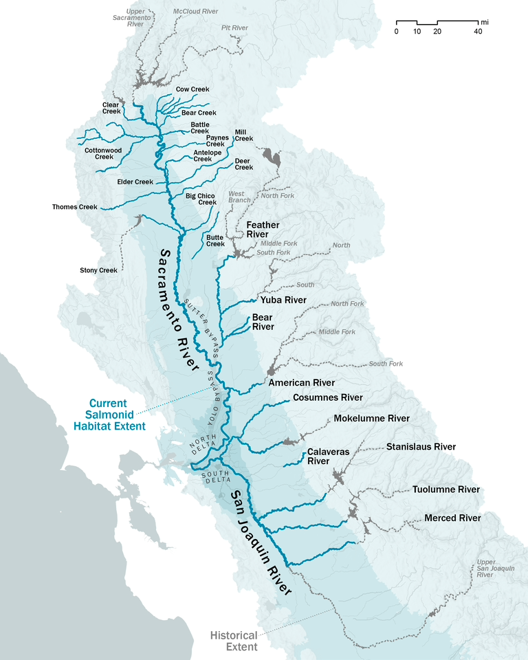

```{r setup, include = FALSE}
knitr::opts_chunk$set(
  collapse = TRUE,
  comment = "#>", 
  fig.width = 9, 
  fig.height = 7
)
library(widgetframe)
library(DSMhabitat)
```

The map below displays existing and theoretical maximum habitat (TMH) for chinook salmon in the Central Valley.

```{r, echo = FALSE, warning = FALSE, message = FALSE, results='asis', eval = FALSE}
library(leaflet)
library(tidyverse)
library(readxl)
library(sf)
library(leaflet.extras2)

salmonid_extents <- st_read(here::here('vignettes','data','rearing_spatial_data', 'salmonid_habitat_extents',  'salmonid_habitat_extents.shp'), 
                            stringsAsFactors = FALSE, quiet = TRUE) %>%
  st_transform(crs = 4326)  # EPSG code for WGS84

sps <- subset(salmonid_extents, Species == 'Spring Run Chinook' & Habitat == 'spawning')
spr <- subset(salmonid_extents, Species == 'Spring Run Chinook' & Habitat == 'rearing')
fs <- subset(salmonid_extents, Species == 'Fall Run Chinook' & Habitat == 'spawning')
fr <- subset(salmonid_extents, Species == 'Fall Run Chinook' & Habitat == 'rearing')
# lfs <- subset(salmonid_extents, Species == 'Late-Fall Run Chinook' & Habitat == 'spawning')
# lfr <- subset(salmonid_extents, Species == 'Late-Fall Run Chinook' & Habitat == 'rearing')
# sts <- subset(salmonid_extents, Species == 'Steelhead' & Habitat == 'spawning')
# str <- subset(salmonid_extents, Species == 'Steelhead' & Habitat == 'rearing')

baseline_projects <- readRDS(here::here('vignettes','data', 'map_data', 'baseline_projects.RDS'))
baseline_proj_pts <- baseline_projects |> 
      filter(st_is(geometry , "POINT"))
    
baseline_proj_poly <- baseline_projects |> 
      filter(st_is(geometry , "MULTIPOLYGON"))
# hqt <- readRDS(here::here('vignettes','data',"map_data", "hqt.RDS"))

tmh_reaches <- readRDS(here::here('vignettes','data','map_data', 'TMH_reaches.rds'))|> 
  st_transform(crs = 4326) |> 
  group_by(river) |> 
  mutate(id = cur_group_id())

rim_dams <- readRDS(here::here('vignettes','data', 'map_data', 'rim_dams.RDS')) |> 
   st_transform(crs = 4326) |> 
   select(NAME, geometry)

dam_barriers <- readRDS(here::here('vignettes','data','map_data', 'dam_barriers.RDS'))

make_label <- function(data) {
  labels <- sprintf("<strong>%s</strong> <br/> %s: %s miles",
                  data$River, 
                  data$Habitat,
                  round(data$miles, 1)) %>% lapply(htmltools::HTML)
}
# SIT MAP 
base_map <-  leaflet() %>% 
      addProviderTiles(providers$Esri.WorldTopoMap, group = "Map") %>% 
      addProviderTiles(providers$Esri.WorldImagery, group = "Satellite") %>%
      # addPolylines(data = str, group = 'Steelhead Rearing', label = make_label(str),
      #              color = '#5e3c99', opacity = .8, weight = 3) %>%
      # addPolylines(data = sts, group = 'Steelhead Spawning', label = make_label(sts),
      #              color = '#e66101', opacity = 1, weight = 3) %>%
      addPolylines(data = spr, group = 'Spring Run Rearing', label = make_label(spr),
                   color = '#5e3c99', opacity = .8, weight = 3) %>% 
      addPolylines(data = sps, group = 'Spring Run Spawning', label = make_label(sps),
                   color = '#e66101', opacity = 1, weight = 3) %>% 
      addPolylines(data = fr, group = 'Fall Run Rearing', label = make_label(fr),
                   color = '#5e3c99', opacity = .8, weight = 3) %>% 
      addPolylines(data = fs, group = 'Fall Run Spawning', label = make_label(fs),
                   color = '#e66101', opacity = 1, weight = 3) 
     
# # ADD R2R hab updates
r2r_map <-
  base_map |> 
      # addPolygons(data = rim_dams, group = 'Rim Dams', popup = rim_dams$NAME, color = "darkblue") 
      # addPolylines(data = tmh_reaches, group = 'TMH River Extent', opacity = .5, weight = 3) |> 
      addCircleMarkers(data = baseline_proj_pts, group = 'Current Restoration Projects', popup = baseline_proj_pts$Description,
                        color = 'darkred', opacity = .6, weight = 2, fillOpacity = 0.6, radius = 5)

# # layers control 
map <- r2r_map |>
  addLayersControl(
        baseGroups = c("Map", "Satellite"),
        overlayGroups = c('Current Restoration Projects',
                          'TMH River Extent','Rim Dams',
                          # "Valley Lowland (<0.04%)",
                          'Fall Run Rearing', 'Fall Run Spawning',
                          # 'Late-Fall Run Rearing', 'Late-Fall Run Spawning',
                          'Spring Run Rearing','Spring Run Spawning'
                          # 'Steelhead Rearing', 'Steelhead Spawning'
                          )) %>%
      hideGroup('Spring Run Spawning') %>%
      hideGroup('Spring Run Rearing') %>%
      # hideGroup('Late-Fall Run Spawning') %>%
      # hideGroup('Late-Fall Run Rearing') %>%
      # hideGroup('Steelhead Spawning') %>%
      # hideGroup('Steelhead Rearing') %>%
      # hideGroup("Valley Lowland (<0.04%)") |>
      # hideGroup('TMH River Extent') |>
      # hideGroup('Rim Dams') |>
      addLegend(colors = c('#5e3c99', '#e66101', "blue"), labels = c('rearing', 'spawning', 'TMH'),
                position = 'topleft', title = 'Habitat Type') %>%
      setView(lat = 38.85, lng = -121.49, zoom = 7.5)
```


