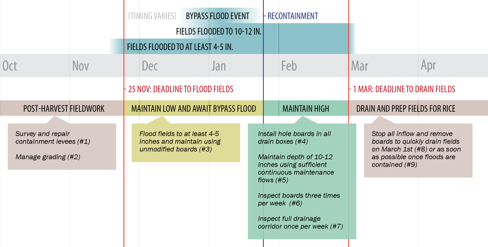
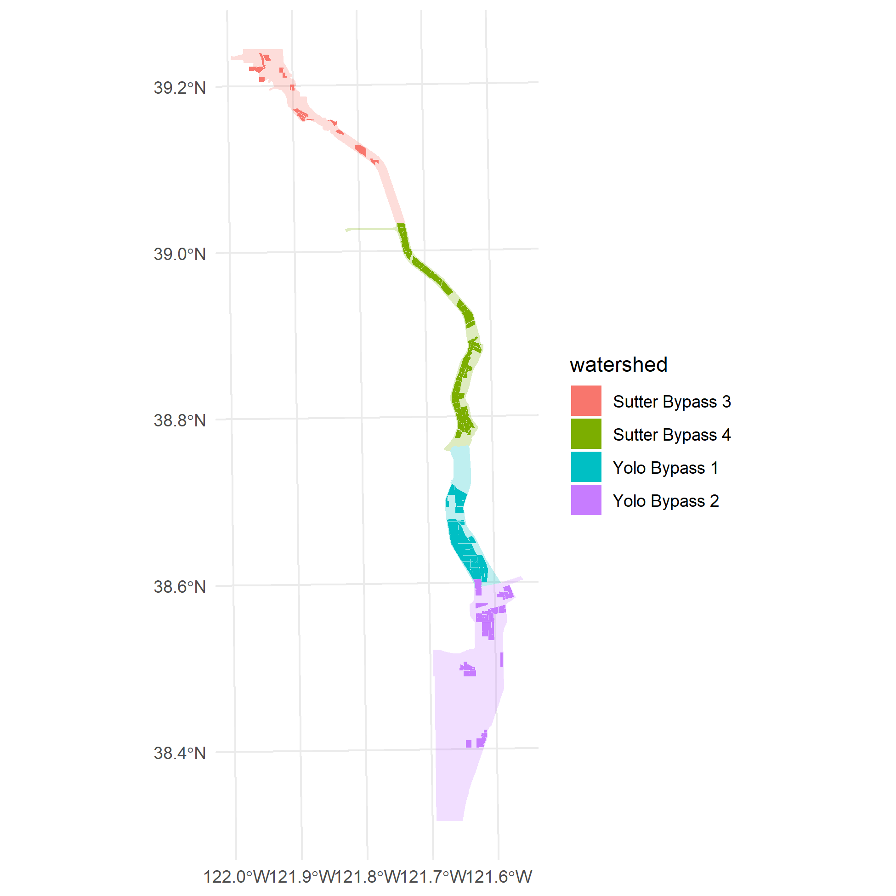
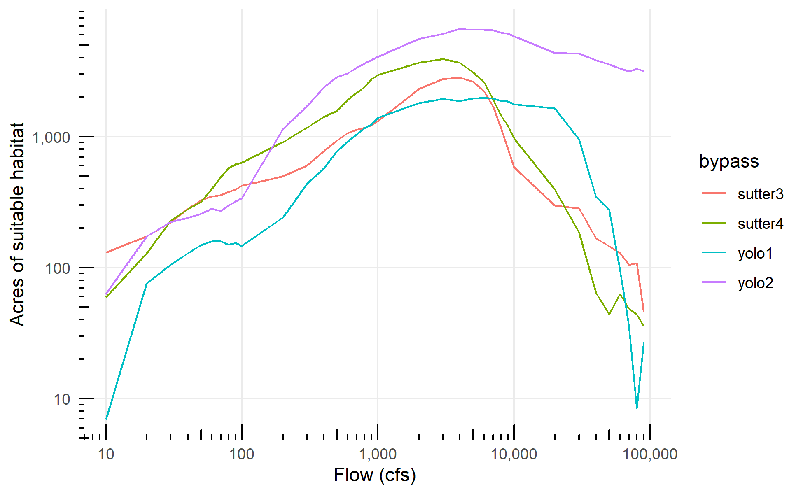
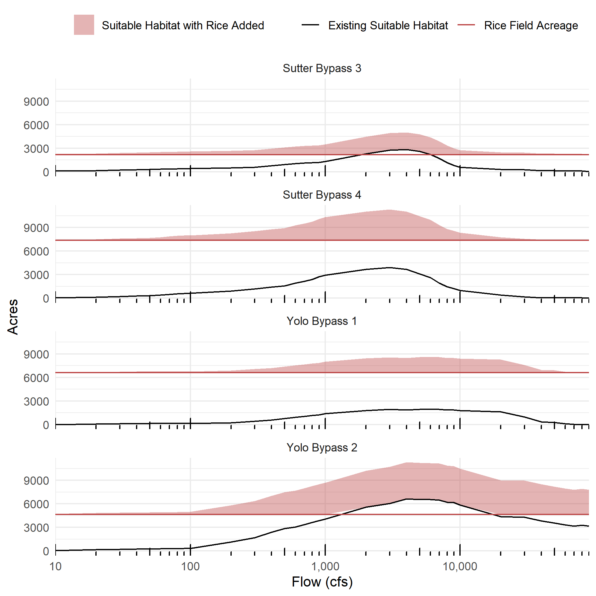
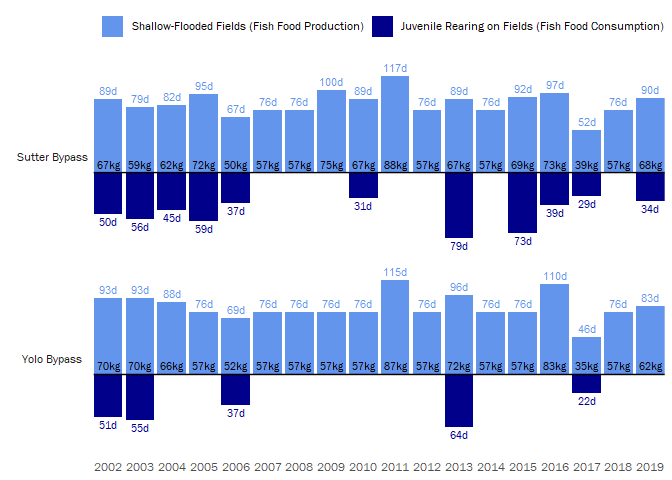
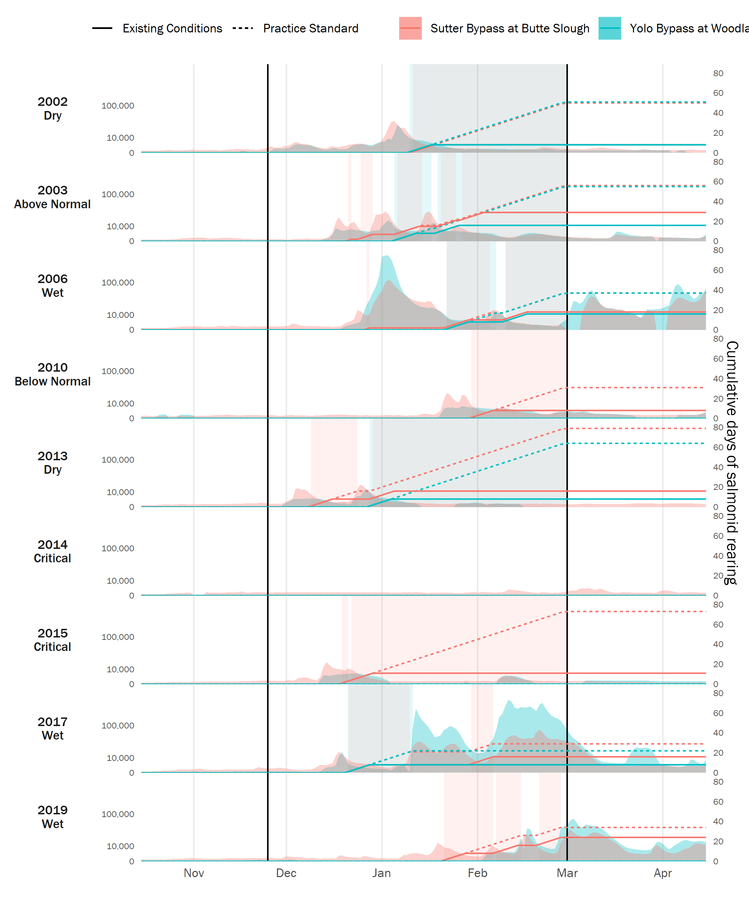
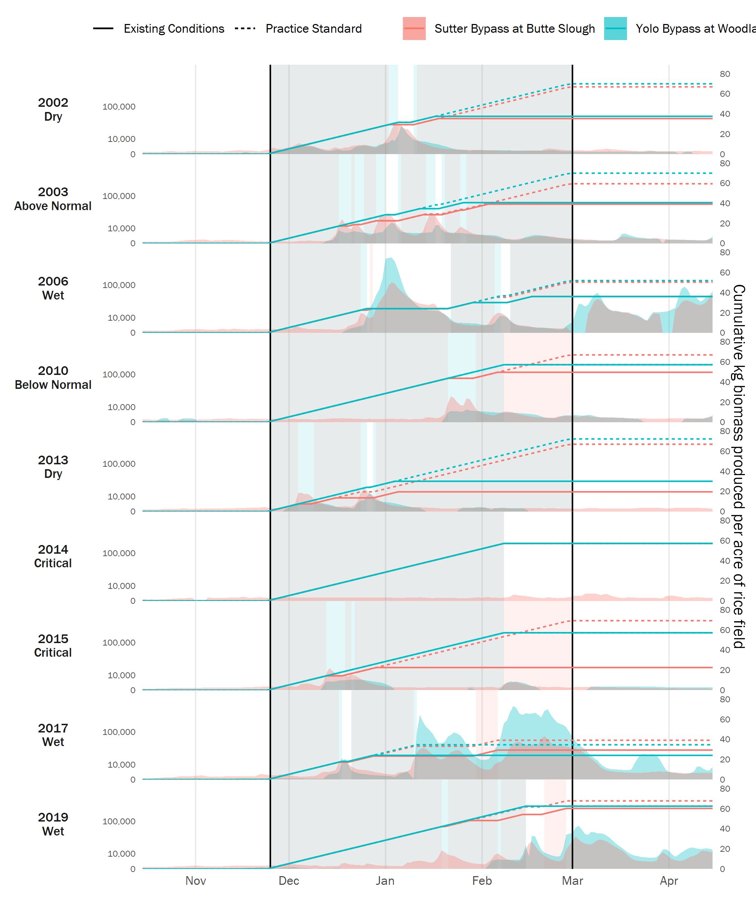

```{r setup, include = FALSE}
knitr::opts_chunk$set(
  collapse = TRUE,
  comment = "#>",
  out.width=692
)
```

This article documents calculations and assumptions for the rice field rearing scenario. 

Review the following resources for more information:

* California Rice Commission - Rice Lands Salmon Rearing Practice Standard (coming soon)

* [Source calculations for rice field acreages](https://github.com/FlowWest/crc-fish-rearing/blob/main/rice-habitat-acreage.md)

* [Source calculations for bypass flows and habitat benefit periods](https://github.com/FlowWest/crc-fish-rearing/blob/main/bypass-flows-habitat-benefit.md)

* [CVPIA bypass habitat modeling details](http://cvpia-habitat-docs-markdown.s3-website-us-west-2.amazonaws.com/watershed/bypasses.html)

* [Rice Flows for Fish Food data package and map](https://flowwest.github.io/riceflows4ff/)

## Background

### Rice Lands Salmon Rearing Practice 

By modifying winter water management practices on rice fields within Sacramento Valley floodplains, the proposed rice lands salmon rearing practice aims to optimize habitat and access to food web resources for native fish. It takes advantage of existing agricultural and drainage infrastructure to mimic the natural flood patterns that were interrupted by wide-spread levee construction and wetland drainage of Sacramento Valley floodplains. The “fish-in-fields” practice would be implemented within the existing bypasses (“wet side”) of the Sacramento Valley, where juvenile salmon would volitionally access and leave fields during seasonal flood inundation events. 

The current conceptual management plan starts with post-harvest fieldwork (September-October) at which point fields are ready to receive and hold flood waters. Once flood waters have receded, enrolled growers will be required to maintain minimum water depths of 10-12 inches until the fields are drained back into the Sacramento River after the termination date. To ensure that fish exit while the river remains cold and discharge remains high, fields are drained on March 1 to release all fish that have not already volitionally left the fields.

```{r echo=FALSE, message=FALSE, warning=FALSE}

```

Compared with the existing management scenario, the application of the rice lands salmon rearing practice may increase juvenile salmon rearing habitat both spatially and temporally. The following sections review the methods used to estimate these benefits for inclusion in the R2R model.

### Fish Food Production Benefit

Winter-flooded rice fields, whether within the bypasses ("wet side") or outside of the bypasses ("dry side"), are immensely productive in the growth of invertebrates (zooplankton), providing food benefits for rearing juvenile salmon. This fish food may be consumed locally in the case of a flooded rice field with juvenile salmon present. Where salmon are not present on the fields (in leveed areas or in years when bypasses have not flooded) the invertebrate-rich water may be flushed out into fish-bearing streams to benefit in-stream juveniles. The resulting increase in prey density on rice field floodplains and in fish-bearing streams downstream of rice fields is an additional benefit to be accounted for in the R2R model. 

## Calculations

### Rice Field Habitat Acreage

#### Total Rice Field Acreage

We analyzed the acreage of rice fields with potential to be activated as salmon habitat through the rice lands salmon rearing practice. 

Bypass sections were delineated based on the definitions from the CVPIA DSMHabitat model, described in [this document](http://cvpia-habitat-docs-markdown.s3-website-us-west-2.amazonaws.com/watershed/bypasses.html). Section boundaries were refined using the "wet/dry sides" layer from [riceflows4ff](https://flowwest.github.io/riceflows4ff/) to avoid capturing bypass-adjacent fields that are on the dry side of the levee. The geographic scope of the analysis was limited to the Sutter Bypass downstream of Colusa Weir, and the Yolo Bypass. These correspond to the following four sections:

* Sutter Bypass Section 3 - Sutter Bypass from Colusa Weir to Tisdale Weir
* Sutter Bypass Section 4 - Sutter Bypass from Tisdale Weir to the Sacramento River
* Yolo Bypass Section 1 - Fremont Weir to Sacramento Weir
* Yolo Bypass Section 2 - Below Sacramento Weir

Rice fields were mapped using the DWR i15 Statewide Crop Mapping datasets, which are available via the [CNRA geodata portal](https://data.cnra.ca.gov/dataset/statewide-crop-mapping). To account for rice fields being fallow in particular survey years, datasets from 2014, 2016, 2018, 2019, 2020, and 2021 were merged and dissolved. Currently this dataset does not include Wild Rice, but should be updated to include it; this will result in a small additional increase in rice field acreage.

Rice fields and bypass sections were spatially joined, then rice field acreages within each section were tallied.

```{r echo=FALSE, message=FALSE, warning=FALSE}

```

The resulting rice field acreage is as follows.

```{r echo=FALSE}
readRDS("rice-field-rearing-scenario/bypass_habitat_with_rice_summary.Rds") |> 
  dplyr::filter(bypass %in% c("sutter3", "sutter4", "yolo1", "yolo2")) |> 
  dplyr::select(bypass, rice_area_ac) |>
  knitr::kable(digits=0, col.names=c("Bypass Section", "Total Acres of Rice Fields"))
```

#### Expansion of Suitable Habitat Area

The CVPIA DSMHabitat model quantifies high quality habitat acreage based on the following hydraulic criteria.
* Channel depth > 0.2 m and < 1.5 m
* Velocity <= 0.15 m/s

Under natural conditions, without the rice lands salmon rearing practice in place, the four habitat sections in question peak when bypass flows are in the range of 5,000 to 10,000 cfs. Below this point, depths are too shallow. Above this point, depths are too deep and/or velocities too high.

```{r echo=FALSE, message=FALSE, warning=FALSE}

```

The inundation of rice fields under the rice lands salmon rearing practice will increase the suitable habitat area. Following bypass floods, water levels are maintained at a depth of 10-12 inches (0.25-0.3 m), bringing this area into the high quality habitat range. We can place a lower and upper bound on the amount of additional suitable habitat that this creates. 

* Upper bound: If under the existing conditions, none of the inundated suitable habitat area is rice fields, then the practice will add the rice field acreage to the existing suitable habitat. `habitat ac = existing modeled habitat ac + rice field ac`

* Lower bound: If under of the existing conditions, all of the inundated suitable habitat area is rice fields, then the practice will only add habitat to the extent that flood waters are being held in more rice field area than would naturally be inundated: `habitat ac = max(existing modeled habitat ac, rice field ac)`

```{r echo=FALSE}
readRDS("rice-field-rearing-scenario/bypass_habitat_with_rice_summary.Rds") |> 
  dplyr::filter(bypass %in% c("sutter3", "sutter4", "yolo1", "yolo2")) |> 
  knitr::kable(digits=0, col.names=c("Bypass Section", "Existing Habitat (ac)", "Rice Fields (ac)", "Flow at Max Habitat (cfs)", "Combined Habitat, Lower Bound (ac)", "Combined Habitat, Upper Bound (ac)"))
```

The highlighted red band represents the range of potential suitable habitat increase if all within-bypass rice fields participate in the practice. The black line represents the existing suitable habitat area without the practice:

```{r echo=FALSE, message=FALSE, warning=FALSE}

```

### Rearing Habitat and Food Production Benefit Periods

Under the rice lands salmon rearing practice, the holding of water on rice fields at 10-12 inches depth begins at recontainment, *i.e.*, once the bypass has flooded and then flood waters have receded. 

For the purpose of this model, based on a simplified reading of the CVPIA DSMHabitat flow-versus-habitat plots, we defined the bypass flood state as within-bypass flow in excess of 10,000 cfs. Recontainment is assumed to have occured when flow has first exceeded the threhold, then dropped back below it. 

Habitat benefit for juvenile salmon rearing begins at recontainment, and ends either when another threshold-exceeding flood occurs, or when fields are drained on March 1st.

Production of zooplankton (fish food) on the floodplain is assumed to occur during these time periods, and *also* to occur during the period from initial winter flood-up of rice fields (November 25) until the first threshold-exceeding flood. 

To model these habitat benefit and food production periods as they would have occured if practices were in place over historical years, flow data are sourced from the following two CDEC gages for water years 2002 to 2019:

* Sutter Bypass at Butte Slough (BSL)
* Yolo Bypass at Woodland (YBY)

The following figure illustrates the results of this analysis for each bypass. Dark blue bars indicate the number of days of rice field juvenile salmon rearing possible in each water year, while light blue bars indicate the number of days of fish food production. Estimates of the volume of fish food production are derived using the estimated rate of invertebrate growth on agricultural wetlands of 0.186 g per square meter per day, per Moss *et al.*, 2009,^[Moss, R.C., Blumenshine, S.C., Yee, J. & Fleskes, J.P. (2009). Emergent insect production in post-harvest flooded agricultural fields used by waterbirds. *Wetlands* 29(3) pp. 875-883. [doi:10.1672/07-169.1](https://doi.org/10.1672/07-169.1)] and assume that growth continues linearly and is not subject to a carrying capacity.

```{r echo=FALSE, message=FALSE, warning=FALSE}

```

The following figure illustrates the calculated rearing habitat benefit periods for a representative selection of water years.

```{r echo=FALSE, message=FALSE, warning=FALSE}

```

The following figure illustrates the calculated food production benefit periods for a representative selection of water years. 

```{r echo=FALSE, message=FALSE, warning=FALSE}

```
